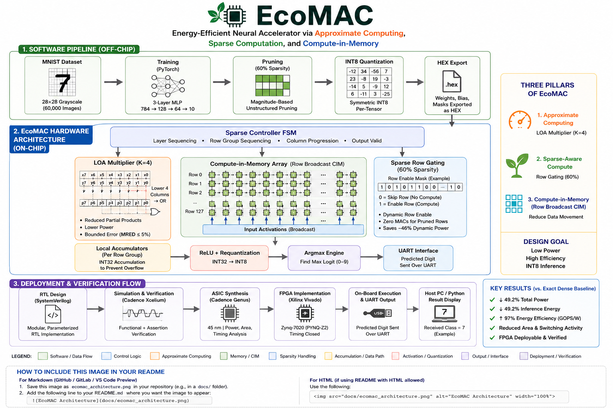

# ASCENT – Energy-Efficient Neural Accelerator using Approximate Computing and Sparse Compute-in-Memory

[]()
[]()
[]()
[]()
[]()

ASCENT (Approximate Sparse Compute-in-Memory Neural Accelerator) is a hardware accelerator designed for low-power neural network inference on edge devices. The project combines **approximate arithmetic**, **sparsity-aware computation**, and a **Compute-in-Memory (CIM)** inspired architecture to significantly reduce power consumption while maintaining inference accuracy.

The accelerator is implemented in **SystemVerilog**, synthesized using **Cadence Genus**, implemented on **Xilinx Vivado**, and targeted for deployment on the **PYNQ-Z2 FPGA**.

---

# Overview

Modern edge AI systems are constrained by power consumption, memory bandwidth, and hardware resources. Conventional neural accelerators perform large numbers of unnecessary MAC operations, especially for sparse neural networks.

ASCENT addresses these challenges using three complementary architectural techniques:

- Approximate Computing through LOA-based multipliers
- Sparse-aware row gating to eliminate redundant MAC operations
- Compute-in-Memory inspired architecture to reduce memory movement

The resulting accelerator achieves significant improvements in energy efficiency while remaining FPGA deployable.

---

# Architecture

```
<p align="center">
  
</p>

---

# Key Features

- INT8 fixed-point neural inference
- Approximate LOA multiplier architecture
- Sparse-aware computation using row gating
- Compute-in-Memory inspired datapath
- Modular SystemVerilog RTL
- Parameterized architecture
- FPGA implementation on Xilinx PYNQ-Z2
- ASIC-oriented synthesis using Cadence Genus

---

# Neural Network

Dataset:

- MNIST Handwritten Digit Classification

Network:

```
784 → 128 → 64 → 10
```

Data representation:

- Signed INT8 activations
- Signed INT8 weights

Model optimizations:

- 60% weight sparsity
- Symmetric INT8 quantization

---

# Project Structure

```
ASCENT/
│
├── rtl/
│   ├── cim_array/
│   ├── sparse_ctrl/
│   ├── uart/
│   ├── top/
│   └── utilities/
│
├── constraints/
│   └── pynq_z2.xdc
│
├── simulation/
│
├── synthesis/
│
├── scripts/
│
├── python/
│   ├── image_preprocessing.py
│   └── uart_host.py
│
├── weights/
│
└── docs/
```

---

# Toolchain

Hardware Design

- SystemVerilog
- Vivado 2023.x
- Cadence Genus
- Cadence Innovus

Machine Learning

- Python
- NumPy
- TensorFlow / PyTorch (training)

Target Hardware

- PYNQ-Z2 FPGA
- XC7Z020

---

# Design Flow

1. Train neural network
2. Apply structured pruning
3. Perform INT8 quantization
4. Export weights as HEX files
5. Simulate RTL
6. Functional verification
7. ASIC synthesis (Genus)
8. FPGA implementation (Vivado)
9. UART-based inference on PYNQ-Z2

---

# Power, Performance and Area

The accelerator was evaluated across three architectural configurations.

| Configuration | Power | Relative Improvement |
|--------------|------:|--------------------:|
| Exact Dense | 47.32 mW | Baseline |
| LOA Dense | 44.56 mW | 5.8% |
| ASCENT (LOA + Sparse) | 24.05 mW | 49.2% |

Additional results:

- 49.2% reduction in inference energy
- 97% improvement in GOPS/W
- Reduced overall gate count compared to baseline
- Successful timing closure in synthesized design

---

# FPGA Demonstration

Inference pipeline:

```
Image
    │
    ▼
Python preprocessing
    │
    ▼
UART Transmission
    │
    ▼
ASCENT Accelerator
    │
    ▼
Predicted Digit
```

---

# Repository Highlights

- Clean modular RTL hierarchy
- Parameterized compute architecture
- Hardware-oriented design methodology
- FPGA implementation flow
- ASIC synthesis flow
- Complete verification environment

---

# Future Improvements

- Wider compute arrays
- AXI-based memory interface
- Dynamic sparsity support
- Batch inference
- Multi-layer pipelining
- CNN accelerator extension

---

# Author

**Balan**

Electronics & Instrumentation Engineering  
RV College of Engineering

Interested in:

- VLSI Design
- Digital Design
- FPGA Acceleration
- Computer Architecture
- Hardware for Machine Learning

---

# License

This project is released under the MIT License.
